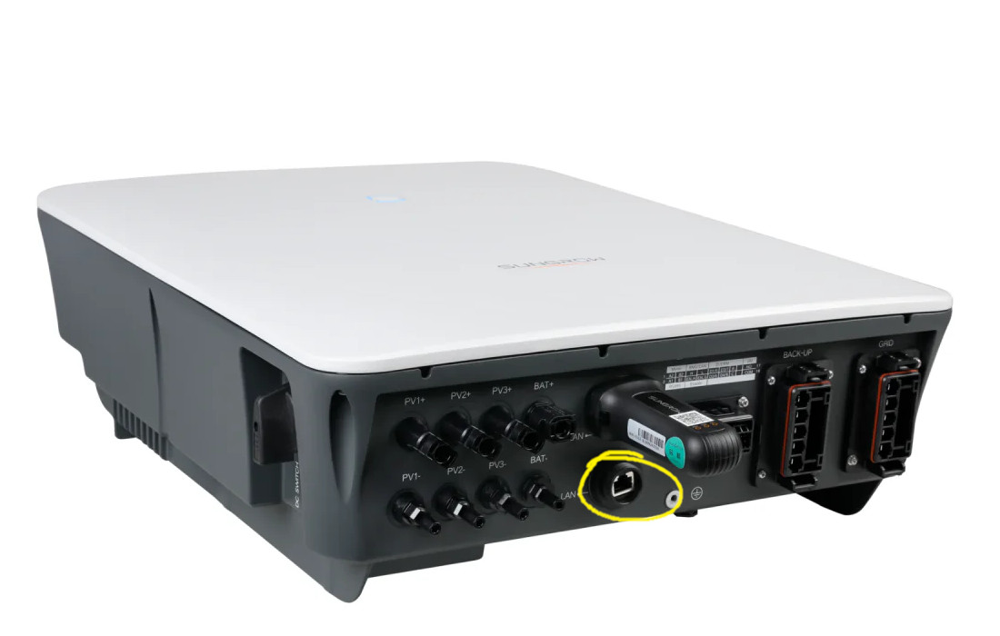
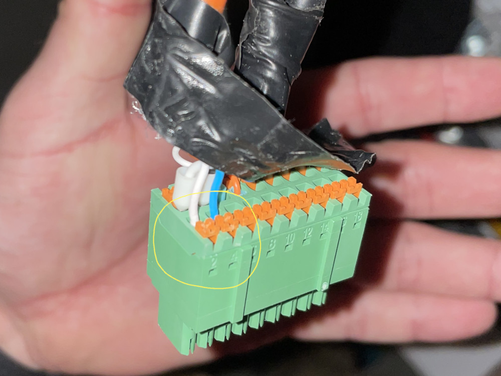

# Home-Assistant-Sungrow-Modbus-Integration
Yet another Sungrow integration for Home Assistant. 

This repository wouldn't be possible without the amazing work of
- [mkaiser](https://github.com/mkaiser/Sungrow-SHx-Inverter-Modbus-Home-Assistant)
- [Louisbertelsmann](https://github.com/Louisbertelsmann/Sungrow-Wallbox-Modbus-HomeAssistant)

# Contents

This repository contains Home Assistant integration files for Sungrow hybrid inverters like SH10RT with a connected Sungrow battery like SBR. It also contains an integration file for Sungrow Wallbox like AC011E.

The repository also comes with a Home Assistant dashboard file that includes plenty of cards to see entity status and metrics. The dashboard also comes with many input settings to configure the inverter, the battery and the Wallbox.

I have tested the integration with Sungrow SH10RT-V112, SBR128 and AC011E. Feedback about other hardware is very much appreciated.

The integration is optimized for Home Assistant Core version 2024.10.2. I highly recommend to update Home Assistant to the most recent version.

# 1. Overview

The inverter and battery integration uses Modbus over TCP which requires a network connection to the inverter via Ethernet. The Wallbox integration however uses Modbus Serial to eliminate interference with the Inverter. This allows more control over the Wallbox using Home Assistant but requires changes to wiring on the inverter. The Wallbox Modbus pins must be removed from the Inverter plug and connected directly to your machine that runs Home Assistant. If your machine is a Raspberry PI or similar, you might have the chance to use UART pins to connect the Wallbox. I run a home server where I recommend buying a "Modbus/RS485 to USB" adapter . More information see (Hardware instructions) below.

# 2. Capabilities

This integration does some things very differently from many other integrations which allows 

## 2.1. What's included

- Wallbox event based sensor handling. Sensor updates are not read periodically but triggered by events like charging events or by changing controls.
- Wallbox single-phase and three-phase mode. This allows much more control over the charge power. Single-phase between 1380W and 3680W. Three-phase between 4140W and 11kW Note: the phase mode cannot be changed during a charge session.
- Wallbox manual mode with desired output current. Manually specify the output current at any time from 6A to 16A in 0.1A steps.
- Wallbox PV-surplus mode. The integration comes with a monitoring automation that automatically updates the output current based on available PV power.

## 2.2. What's not included

- Inverter MPPT scan. Other integrations include this. However, I observed major issues with sensors and automations related to this scan shutting down one or both of my PV strings. This is not specified in Sungrow documentations. Also I don't see a use case for running scans. With the described issues and lack of documentation I decided to not include this feature.
- Wallbox working mode. Other integrations include this sensor. Sungrow documentations specified an input register to read the working mode (Plug & Play, EMS or Network). In reality this register is not readable. Also, the wallbox has Modbus only enabled in EMS mode. Therefore this integration does not include an entity for working mode.

## 2.3. What's upcoming

- [ ] Add Inverter firmware information.
- [ ] Add Inverter alarm and system fault.
- [ ] Improve Inverter event based sensor updates.

- [ ] Add Wallbox PV surplus overnight automation.
- [x] Improve Wallbox PV surplus calculation.

- [ ] Improve dashboard. Create separate Inverter and Wallbox dashboards.
- [ ] Define better power and energy tabs for dashboards.
- [ ] Add configuration tabs for each dashboard.

# 3. How to install

Following steps are needed to install the integration.

## 3.1. Hardware instructions

The network diagram represents how Home Assistant is connected in my home network together with the inverter and the wallbox.


### 3.1.1. Inverter

For the Sungrow Inverter you will need to use an ethernet cable and connect the LAN port of the inverter to your home network. Your DHCP server, most likely operated by your home router, will assign an IP address to your inverter. You will need to find the assigned IP address from your DHCP server / your home router.



### 3.1.2. Wallbox

Disclaimer: The wallbox takes more effort to connect to Home Assistant and involves disconnecting the Wallbox Modbus wires on the inverter's COM port. The steps are not difficult but always exercise caution when working with electricity or with electronic devices. It requires powering off your home electricity to safely perform the modification. Only continue if you know what you are doing. Consult your electrician if you want this modification done professionally. The instructions is subject to change and may be incomplete or not specific to your setup or environment. I will not provide any warranty for issues or damages. If you have any questions, feedback or concerns, feel free to reach out.

For the Sungrow Wallbox the Home Assistant integration needs a direct Modbus connection via RS485 to get full control over the Wallbox. The data communication uses two wires. You can either connect a USB dongle to your machine that runs Home Assistant or, if supported by your machine like Raspberry PI, connect the two wires to the UART pins. I use a dongle with a CH340 chip that you can get for cheap on Amazon. This is the dongle I bought (no affiliate link; I have no relation to the seller or anything) https://amzn.eu/d/0b6UBwyd

Most likely your wallbox's Modbus wires are connected to the inverter's COM port. You can either cut the wires and leave loose wires connected to the inverter or disconnect the wires from the inverter's COM port. I chose the latter. The following steps only describes this approach. Below picture shows the COM connector and the pin rail with pin 2 and 4 which are the Modbus wires of the wallbox.



#### **Step 1: Make sure to shutdown and turn off the inverter.** 

I chose to turn off the main fuses in the breaker box to disconnect the grid and the backup from the inverter. I also chose to turn off the DC switch to disconnect all PV strings from the inverter. Last I turned off the fuse on the battery itself. That way the inverter should have absolutely no power source to stay on.

#### **Step 2: Once the inverter is fully turned off, disconnect the COM connector from the port.**

To do so you'll need to pull the latch on the connector, then pull the connector out of the inverter.

#### **Step 3: Release the pin rail from the connector.**

Be careful with the step to prevent breaking wires. The pin rail is the green part inside the connector and hold inside with another latch. Pull the latch and move the connector frame up the cable to get enough access to the connected wires.

#### **Step 4: Release the Wallbox Modbus wires.**

The wallbox is connected to pin 2 (Data+) and pin 4 (Data-). Make notes of the wire color before disconnecting. To release a wire, push and hold down the orange latch then carefully pull the wire. You can use tools to push the latch but be careful not to break any wires.

#### **Step 5: Ensure the cable of the two wires is released as well.**

Once the two wires are released from the pin rail, release the cable as well. In my setup that's the orange cable which is taped together with all other cables. I carefully removed the adhesive tape to fully remove the cable.

#### **Step 6: Now reassemble the COM connector and plug it back in to the inverter.**

Ensure the other pins (smart meter, battery, etc.) have not been affected in any way.

#### **Step 7. Turn back on the inverter.**

Make sure the DC switch and all electrical fuses are back on. In my setup I have not observed that a specific order has to be followed but I tend to start with the grid fuse, battery fuse, DC switch and then backup fuse.

#### **Step 8: Make sure the smart meter, battery and other devices connected to the COM connector are still functional.**

If you observe anything suspicious, reach out for professional support.

#### **Step 9: Connect the Wallbox Modbus wires to the Modbus USB dongle.**

Connect the wire from pin 2 to the D+ pin of the dongle. Connect the wire from pin 4 to the D- pin of the dongle. Now you can connect the dongle to the Home Assistant machine. The machine should auto detect the device as `/dev/ttyUSB0`.

## 3.2. Home Assistant instructions

After wiring up the inverter and the wallbox, it comes to setup both in Home Assistant. These steps involve changing and adding yaml files in Home Assistant. I recommend installing the Visual Studio Code Add-on in Home Assistant. Navigate to Settings and open the Add-on Store. Search for Studio Code Server and install.

### 3.2.1. Update configuration.yaml

This integration uses yaml files which we want to store in a folder called `integrations`. To make Home Assistant recognize the yaml files we need to make it search for integrations in this folder.

Open Studio Code Server in Home Assistant and open the file configuration.yaml. Add the following lines to the file:

```yaml
homeassistant:
  packages: !include_dir_named integrations
```

For good measure, use Studio Code Server in Home Assistant and create the folder called `integrations`.

### 3.2.2. Update secrets.yaml

This file is used to write down your configuration of your inverter and wallbox. This includes the IP address of your inverter and the serial port name of the RS485 serial dongle. These configuration parameters are used by the actual integration files.

The inverter is connected via ethernet. Ensure you have identified the DHCP assigned IP address of your inverter. Most likely you're using a home router with integrated DHCP server. Your home router usually comes with a web interface or an app that allows you to check for network devices and IP addresses.

The wallbox is connected with a RS485 serial dongle. The dongle's port is most likely `/dev/ttyUSB0`. To ensure the port open Home Assistant and go to Settings, System, Hardware, then click on `All Hardware`. In the searchbox enter `tty` and check the filtered list of hardware if it includes a device called ttyUSB0. If you don't see such a device try restarting Home Assistant.

Open Studio Code Server in Home Assistant and open the file secrets.yaml. Add the following lines to the file. Use your specific IP address and serial port:

```yaml
# Inverter specific configuration
sungrow_modbus_host_ip: 192.168.0.3
sungrow_modbus_port: 502
sungrow_modbus_slave: 1

# Wallbox specific configuration
wallbox_modbus_port: "/dev/ttyUSB0"
wallbox_modbus_slave: 248
```

### 3.2.3. Install sungrow_inverter.yaml

The file sungrow_inverter.yaml contains the Modbus integration for the inverter including all sensors, helpers, input controls and automations.

In GitHub navigate to the integrations folder in this repository and download the file `sungrow_inverter.yaml`. 

Open Studio Code Server in Home Assistant. Right click on the previously created folder `integrations` and select `Upload…`. Select the downloaded file and hit Open. 

### 3.2.4. Install sungrow_wallbox.yaml

You can skip this step if you don't have a Sungrow Wallbox or don't want to change the wiring.

The file sungrow_wallbox.yaml contains the Modbus integration for the wallbox including all sensors, helpers, input controls and automations.

In GitHub navigate to the integrations folder in this repository and download the file `sungrow_wallbox.yaml`.

Open Studio Code Server in Home Assistant. Right click on the previously created folder `integrations` and select `Upload…`. Select the downloaded file and hit Open. 

### 3.2.5. Install sungrow_dashboard.yaml

You can skip this step if you don't want to use my basic Home Assistant dashboard for the inverter and wallbox.

Note: This is my always work-in-progress dashboard. You can use it to get used to the integrations and eventually create your own dashboard tailored to your individual preference.

In Home Assistant go to Settings, Dashboards, then click on Create Dashboard. Select `Create a new dashboard`. Define a title and click on `Create`. Now in the Home Assistant sidebar, go to the newly created dashboard. In the top right click on the edit button and then again, top right, the three dot icon. Select `Raw-Config editor`. 

In GitHub navigate to the dashboard folder in this repository and open the file `sungrow_dashboard.yaml`. In the top right click on Copy raw file. Now back to Home Assistant paste the copied text into the Raw-Config editor. Now click `Save`, then `Done`. The new dashboard is immediately applied. Don't worry if the dashboard doesn't show values for the entities. The integrations are not yet applied.

### 3.2.6. Install Power Flow Card Plus

This is optional. The dashboard uses a special power flow card to demonstrate the power flow of your setup. My favorite solution is Power Flow Card Plus. Check out the GitHub site for how to install.

https://community.home-assistant.io/t/power-flow-card-plus/552326
https://github.com/flixlix/power-flow-card-plus

## 3.3. Restart Home Assistant

In order to apply the integrations you need to restart Home Assistant. Go to `Developer tools` and click on `Restart`. Select `Restart Home Assistant and confirm.

<!--
 https://github.com/Roemer/plantuml-office 
 https://plantuml.com/de/nwdiag
 https://plantuml.com/de/stdlib
 
 -->
